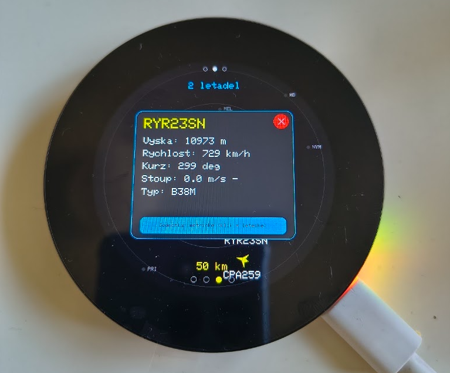
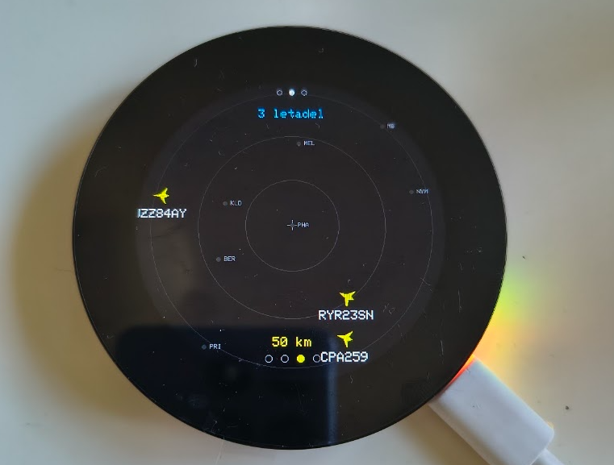
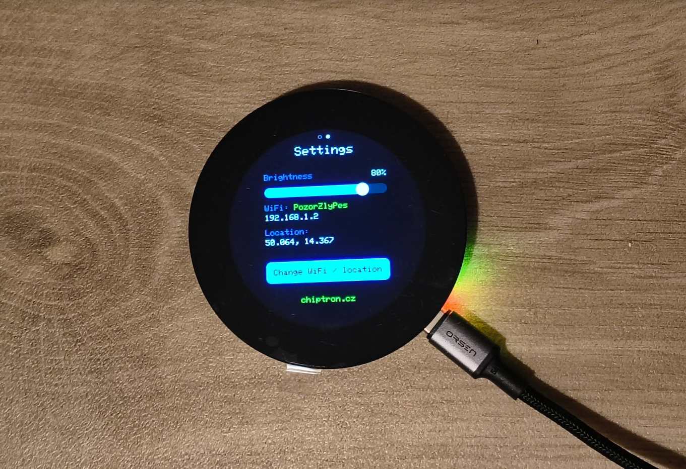

# European Plane Radar

**Live aircraft radar on a round touchscreen.**

Air traffic from adsb.fi on a single device. Tap an aircraft to see what it is, how high it is and where it is heading. Everything runs on one board — no soldering, no wiring.

[](https://www.espressif.com/en/products/socs/esp32-s3)
[](https://www.arduino.cc/)
[](https://www.waveshare.com/wiki/ESP32-S3-Touch-LCD-2.1)

> Built for [chiptron.cz](https://chiptron.cz)

---

## What it does

Two screens, switched by swiping.

### ✈️ Aircraft radar

Data from [adsb.fi](https://adsb.fi/) — a public ADS-B network, free and without an API key.

Aircraft are drawn as silhouettes **rotated to match their actual ground track**. Machines that do not report a track are shown as a circle instead — so you are never misled by a fake heading.

**A short tap on an aircraft** opens the detail: callsign, altitude, speed, track, climb/descent rate and aircraft type. A button in the detail switches between **aviation units** (ft, kt, ft/min) and **metric** (m, km/h, m/s). The choice survives a reboot.

Aircraft are **coloured by altitude**, so a glance tells you whether something is on approach overhead or just transiting at cruise:

| Band | Colour | Typically |
|------|--------|-----------|
| **< 2 km** | 🔴 red | approach/departure, helicopters, light aircraft |
| **2–6 km** | 🟠 orange | climb/descent, regional traffic |
| **6–10 km** | 🟡 yellow | lower cruise levels |
| **≥ 10 km** | 🔵 blue | long-haul cruise |

An aircraft that reports no altitude is drawn grey rather than being forced into the "low" band. A small legend on screen shows the scale.

Underneath the aircraft the app draws **European country outlines and cities**, so it is obvious whether that plane is over Kladno or over Kolín — and it works just as well in Warsaw, Lisbon or London.

**Ranges:** 10 / 25 / 50 / 100 km

<p align="center"><a href="img/PlaneRadar_planes1.png"></a></p> <p align="center"><a href="img/PlaneRadar_planes2.png"></a></p>

### ⚙️ Settings

Display brightness, WiFi status, location. Plus a button that launches the configuration portal.

<p align="center"><a href="img/PlaneRadar_settings.png"></a></p>

---

## Hardware

The whole thing runs on a single board: **Waveshare ESP32-S3-Touch-LCD-2.1**

| Component | Description |
|-----------|-------------|
| **ESP32-S3R8** | 8 MB PSRAM, 16 MB flash |
| **Display** | round IPS 480×480 px, ST7701 controller (RGB interface) |
| **Touch** | capacitive CST820 (I2C) |
| **Expander** | TCA9554 — drives LCD reset, CS and power |

No wiring, no soldering. The display and the microcontroller sit on one board; all you need is a USB cable.

---

## Installation

### 1. Libraries

In the Arduino IDE (**Tools → Manage Libraries**) install:

| Library | Author |
|---------|--------|
| **GFX Library for Arduino** | moononournation |
| **ArduinoJson** | Benoit Blanchon (version 7.x) |
| **WiFiManager** | tzapu |

> ⚠️ Look for exactly **"GFX Library for Arduino"** by *moononournation* — it is not Adafruit GFX.

QRCode (ricmoo, MIT) is bundled directly with the project; there is nothing to install.

### 2. Board settings

**Tools →**

| Item | Value |
|------|-------|
| Board | ESP32S3 Dev Module |
| **PSRAM** | **OPI PSRAM** ← required! |
| Flash Size | 16MB (128Mb) |
| Partition Scheme | anything with an **APP partition ≥ 3 MB** (e.g. 3MB APP/9.9MB FATFS) |
| USB CDC On Boot | Enabled |
| Upload Speed | 921600 |

> ⚠️ **Without OPI PSRAM enabled the display stays black.** It is by far the most common cause of trouble.

**On the partition scheme:** the project **uses no filesystem** (neither LittleFS nor SPIFFS) — everything is drawn straight from RAM. You do not need to worry about data partitions; the firmware just has to fit (~3 MB). The default scheme works. If the sketch ever fails to fit, pick anything with a larger APP partition, for example *16M Flash (3MB APP/9.9MB FATFS)* — the data partition will go unused, which is fine.

### 3. Flashing

Open `PlaneRadar.ino` — the other files load as tabs. Upload to the board in Arduino IDE.


Download the Binary file from relase (https://github.com/petus/EuropeanPlaneRadar/tags)

Go to https://esp32flasher.chiptron.cz/

Upload the binary file

Flash it

### 4. First run

1. The device creates an open WiFi network called **`PlaneRadar-Setup`**
2. A **QR code** appears on the display — scan it with your phone
3. Connect and pick your home WiFi
4. Save

**You do not have to enter a location** — it is detected automatically from your IP address. A manually entered value always takes precedence.

---

## Controls

| Gesture | Function |
|---------|----------|
| **Swipe** left/right | switch screen |
| **Short tap** on an aircraft | aircraft detail |
| **Long press** | change range |
| **Hold BOOT** at startup (~3 s) | factory reset |

---

## Implementation notes (Arduino and the 2.1" display)

A few things everyone starting with this board runs into.

### LovyanGFX will not drive the ST7701

Not easily, at least. The panel runs over an RGB interface and the CS pin hangs off the TCA9554 I2C expander, which the library does not handle out of the box.

**Solution:** [Arduino_GFX](https://github.com/moononournation/Arduino_GFX) on top of a direct `esp_lcd` RGB panel with a hand-written ST7701 init sequence.

### Display flicker

Drawing straight into the panel makes the display flicker on every redraw.

**Solution:** an off-screen canvas in PSRAM — the whole frame is drawn into memory and then pushed out in one go via `flush()`.

### Map underlay

The country outlines and the cities are stored as **GPS coordinates** and projected with the same projection as the aircraft positions. The view therefore adapts by itself to your location and the selected range.

The map covers **EU-27 plus the UK, Switzerland and Norway** — about 31 000 border vertices and 1 100 cities, roughly **170 kB of flash** (5 % of the APP partition). Coordinates are stored as `uint16` fixed point rather than floats, which halves the cost at a quantisation of ~122 m — far below the ~555 m simplification tolerance, so it costs nothing visually.

Drawing all 31 000 points every frame would be hopeless. Instead the screen works out which geographic window can actually be on screen and passes it to `EuBorder`, which **rejects whole countries by bounding box** before touching the framebuffer. In practice fewer than ~300 line segments survive per frame anywhere in Europe, so the map is effectively free.

Cities are **tiered by population** so dense regions stay readable: at 100 km only cities above 300k are drawn, at 50 km above 150k, and below 25 km everything down to 50k. Without this the Ruhr or the Randstad would bury the traffic under a wall of labels.

---

## Project structure

```
PlaneRadar/
├── PlaneRadar.ino          main file, screen manager, gestures
├── Display_ST7701.cpp/h    display driver (RGB panel + SPI init)
├── Touch_CST820.cpp/h      capacitive touch
├── TCA9554.cpp/h           I/O expander
├── ADSB.cpp/h              fetching the aircraft data
├── EuBorder.cpp/h          map underlay: drawing + culling
├── EuMapData.h             generated: European borders + cities
├── ScreenPlanes.cpp/h      screen 1: aircraft + detail
├── ScreenSettings.cpp/h    screen 2: settings
├── WiFiPortal.cpp/h        WiFi + configuration portal
├── GeoIP.cpp/h             location detection by IP
├── Settings.cpp/h          persistence to NVS
├── Watchdog.cpp/h          watchdog for 24/7 operation
├── UI.cpp/h                shared helpers (text, QR)
└── qrcode.c/h              QR library (ricmoo, MIT)
```

---

## Data sources

| Data | Source | Note |
|------|--------|------|
| **Aircraft** | [adsb.fi](https://adsb.fi/) | free, no API key, personal use |
| **Location** | [ip-api.com](https://ip-api.com/) | automatic detection by IP |
| **Borders** | [Natural Earth](https://www.naturalearthdata.com/) 1:10m | public domain |
| **Cities** | [GeoNames](https://www.geonames.org/) | CC BY 4.0, population ≥ 50 000 |

> ⚠️ **Credit the sources when you use this.** adsb.fi requires it in their terms. adsb.fi is intended for personal, non-commercial use.

You do not need your own ADS-B receiver — adsb.fi aggregates data from thousands of volunteers.

---

## Inspiration

This project did not appear out of thin air. It builds on two existing ones:

- **[MatixYo/ESP32-Plane-Radar](https://github.com/MatixYo/ESP32-Plane-Radar)** — the original aircraft radar and the adsb.fi source
- **[Selbyl/ESP32-S30Touch-LCD-2.1_Plane-Radar](https://github.com/Selbyl/ESP32-S30Touch-LCD-2.1_Plane-Radar)** — the port to the Waveshare 480×480

---

## Troubleshooting

**The display stays black**
→ Check that you have **PSRAM: OPI PSRAM** set in Tools. That is the most common cause.

**The aircraft radar is empty**
→ Try a larger range. At night or away from the flight corridors there simply may be nothing there.

**No country outline is visible**
→ This is normal when you are far inland. Prague, for example, is ~84 km from the nearest border, so at the 10, 25 and 50 km ranges there is genuinely no border inside the radar circle — only city markers. Switch to 100 km, or move the range up, and the outline appears.

**Aircraft appear without a callsign**
→ Not every machine transmits one. In that case the ICAO hex code is shown instead.

**Fetching fails**
→ Look at the serial monitor (115200). It will tell you whether WiFi, HTTP or JSON parsing is the problem.

---

## Licence

The code is under the **[MIT](LICENSE)** licence — you are free to use, modify and
commercially deploy it.

### A request beyond the licence

MIT gives you full freedom. Even so, I would be glad if you kept the
**"chiptron.cz" line on the settings screen** — at the same size and colour as in the original.

It costs you nothing and it means a lot to me. But it is a **request, not a condition**.
If you decide otherwise, the licence still applies in full.

If you build something interesting on top of this, I would love to hear about it.

### Third parties

- The bundled [QRCode library](https://github.com/ricmoo/QRCode) (ricmoo) — MIT
- Border geometry from [Natural Earth](https://www.naturalearthdata.com/) — public domain,
  obtained via the [world-atlas](https://github.com/topojson/world-atlas) TopoJSON redistribution (ISC)
- City data from [GeoNames](https://www.geonames.org/) — **CC BY 4.0**, which requires attribution
- Data from adsb.fi is subject to the provider's terms

> ⚠️ **A word on commercial deployment:** the free adsb.fi API is intended for
> personal use. For a commercial product, arrange appropriate access to the data.

---

<div align="center">

**Built for [chiptron.cz](https://chiptron.cz)** by Claude AI

*When you want to know what is flying over your head.*

</div>
